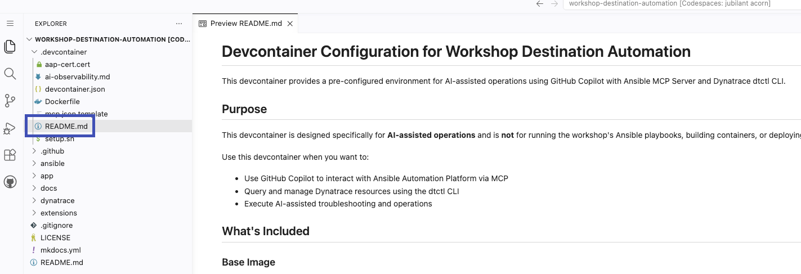

# Delegate

In this phase, you delegate observation and automation tasks to AI coding agents like GitHub Copilot and Claude Code. Instead of manually navigating Dynatrace dashboards or AAP UIs, you express intent in natural language and let the agent invoke Dynatrace `dtctl` and the Ansible MCP Server on your behalf.

## Objectives

- Set up a local development environment with the workshop repository
- Install and configure Dynatrace `dtctl` with AI observability skills for GitHub Copilot
- Configure the Ansible MCP Server for AAP-driven automation
- Use Copilot to query Dynatrace for AI Travel Advisor telemetry
- Use Copilot to change the AI Travel Advisor runtime through AAP
- Delegate an end-to-end "analyze and remediate" task to Copilot

??? warning "Self-signed Certificates"
    In this workshop, AAP Gateway and AAP Ansible MCP Server utilize self-signed certificates.  Visual Studio Code will not allow you to connect to the Ansible MCP Server if the cert is untrusted.

## Prerequisites

Both Dynatrace `dtctl` and the Ansible MCP Server require token-based authentication. Before proceeding with workspace setup, ensure you have generated the required access tokens with appropriate scopes for your role.

### Dynatrace Platform Token

All users (instructors and participants) require a Dynatrace Platform Token with read-only access to telemetry and configuration data. Platform Tokens are created through the Dynatrace Account Management portal, not within your environment.

**Generate the Token**

Navigate to the [Dynatrace Account Management](https://account.dynatrace.com/){target="_blank"} portal and log in with your Dynatrace credentials. From the navigation menu, select **My platform tokens**. Click **Create token** and provide a descriptive name such as `workshop-destination-automation-dtctl`.

Under **Token scopes**, enable all scopes required for read-only `dtctl` access as documented in the [dtctl token scopes reference](https://dynatrace-oss.github.io/dtctl/docs/token-scopes/){target="_blank"}.

??? info "Token Scopes"
    - `account-idm:users:read` - Read user information
    - `account-idm:groups:read` - Read group information  
    - `account-idm:tenant-read` - Read tenant information
    - `account-env-manage:environments:read` - Read environment details
    - `app-engine:apps:run` - Execute DQL queries via apps
    - `automation:workflows:read` - Read workflow configurations
    - `automation:workflows:run` - Execute workflows
    - `document:documents:read` - Read dashboard and notebook documents
    - `document:documents:write` - Required for certain document operations
    - `storage:metrics:read` - Query metric data via DQL
    - `storage:logs:read` - Query log data via DQL
    - `storage:spans:read` - Query distributed trace spans via DQL
    - `storage:events:read` - Read events and problems
    - `storage:entities:read` - Read entity data for services and processes

Generate the token and copy it immediately—the Account Management portal displays it only once. Store it securely as you will use it during `dtctl` authentication in [Step 1](#step-1-setup-your-local-workspace).

For detailed explanations of each scope and the minimum required permissions, consult the [Platform Tokens documentation](https://docs.dynatrace.com/docs/shortlink/platform-tokens){target="_blank"}.

### Red Hat Ansible Automation Platform Token

Each user requires a Platform API Token scoped to their workshop role. Instructors need `write` access to launch job templates and modify resources. Participants need `read` access to query job status and retrieve execution logs.

**Generate the Token**

Log in to AAP Gateway as your assigned user (instructor or participant). Click your username in the top-right corner and select **User Settings**. Navigate to the **Tokens** tab and click **Create token**.

Provide a descriptive name such as `workshop-delegate-write` or `workshop-delegate-read` depending on your role. Under **Scope**, select:

- **Write** for instructors who will execute job templates and modify application state
- **Read** for participants who will observe job executions and query automation status

Generate the token and copy it immediately—AAP displays it only once. Store it securely as you will use it when configuring the Ansible MCP Server in [Step 1](#step-1-setup-your-local-workspace).

??? warning "Token Security"
    Platform API Tokens provide the same access level as your user credentials. Treat them as sensitive secrets. Do not commit tokens to version control or share them in public channels. When working in a shared environment like GitHub Codespaces, ensure tokens are stored in local configuration files that are excluded from git tracking (`.vscode/mcp.json` is gitignored in this repository).

## Step 1: Setup Your Local Workspace

In this step, prepare a local development environment that an AI coding agent can operate on.

!!! example "Use GitHub Codespaces for Workspace"
    It is highly recommended to use GitHub Codespaces for your workspace instead of running Visual Studio Code locally on your machine for this workshop.

    [](https://codespaces.new/dynatrace-wwse/workshop-destination-automation){target="_blank"}

    Choose the `devcontainer` branch, your preferred region, and 2-core machine type.

    Once it finishes provisioning, open the `.devcontainer/README.md` for instructions to easily set up your workspace before moving on to **[Step 2: Query Dynatrace Through Copilot](#step-2-query-dynatrace-through-copilot)**

    

Clone the workshop repository to your local machine (`cd` into the desired parent directory first):

```bash
git clone https://github.com/dynatrace-wwse/workshop-destination-automation.git
cd workshop-destination-automation
```

Open Visual Studio Code and open the cloned `workshop-destination-automation` directory as a new workspace (**File** -> **Open Folder...**)

??? tip "Why a Local Workspace?"
    AI coding agents work best when they have direct access to a project's files, history, and context. Opening the workshop repo as a workspace gives Copilot visibility into Ansible playbooks, application code, and the supporting documentation it can use to ground its answers and actions.

### Dynatrace `dtctl` for Copilot

`dtctl` is a kubectl-style command-line tool for the Dynatrace platform. It provides unified access to workflows, dashboards, DQL queries, settings, extensions, AI capabilities, and more - all through familiar verb-noun commands like `get`, `describe`, `apply`, `execute`, and `delete`. Built for both humans and AI agents, dtctl offers structured output formats, declarative configuration via YAML, multi-environment context switching, and real-time watch mode. In this lab, you'll use dtctl paired with Copilot skills to execute DQL queries, inspect distributed trace spans, and reason about AI Travel Advisor service health on your behalf.

**Install**

Install `dtctl` on your workstation by following the published [installation steps for your OS](https://dynatrace-oss.github.io/dtctl/docs/installation/){target="_blank"}

Install the Dynatrace AI skills for GitHub Copilot **into the local workspace** so they apply only to this workshop repo, by running the following command with your terminal in the `workshop-destination-automation` directory:

```bash
dtctl skills install --for copilot
```

**Authenticate**

[Authenticate](https://dynatrace-oss.github.io/dtctl/docs/quick-start/){target="_blank"} `dtctl` against your Dynatrace tenant using Dynatrace SSO credentials:

```bash
dtctl auth login --context destination-automation --environment "https://abc12345.apps.dynatrace.com"
```

**Train**

Add a custom reference for AI observability so the agent understands GenAI semantic conventions (`gen_ai.request.model`, `gen_ai.usage.input_tokens`, `traceloop.span.kind`, etc.) used by the AI Travel Advisor instrumentation.

```bash
cp dynatrace/skills/references/ai-observability.md .github/skills/dtctl/references/ai-observability.md
```

Add the following line to **SKILL.md** in the `## Additional Resources` section:

```bash
- **AI Observability & GenAI**: [references/ai-observability.md](references/ai-observability.md)
```

**Validate**

Validate the integration by asking Copilot a simple question, for example:

```
Use Dynatrace to find the latest AI model used by the `ai-travel-advisor` service.
```

??? info "What the AI Skills Provide"
    The installed skills give Copilot a structured knowledge base of DQL syntax, common query patterns, and AI observability concepts. This dramatically improves accuracy: the agent will use `toUid()` for trace ID filters, double quotes for strings, and look for GenAI attributes on the correct child spans rather than the root span.

### Ansible MCP Server for Copilot

The Model Context Protocol (MCP) is an open standard enabling AI agents to securely connect to external systems. MCP Servers bridge AI agents and APIs, translating natural-language requests into authenticated calls and returning structured responses. The Ansible MCP Server implements this for Red Hat Ansible Automation Platform, exposing AAP resources as callable tools. It provides job template discovery and launch, execution monitoring and log retrieval, inventory inspection, and organization-scoped filtering. In this lab, you'll configure it with a Platform API Token so Copilot can list templates, launch jobs with custom variables, monitor execution, and retrieve output through conversational prompts.

**Configure**

Log in to AAP as your assigned user (instructor or participant).  From your user profile, manually generate a **Platform API Token** with the appropriate scope:

- **write** for instructors who will launch and modify resources
- **read** for participants who will primarily observe

Open the VS Code MCP configuration (`.vscode/mcp.json`) and add the Ansible MCP Server entries (job manager, inventory, etc.), supplying:
    - the AAP base URL
    - the platform API token from the previous step

Reload the MCP server configuration in VS Code

**Validate**

Validate the integration by asking Copilot:

```
List the AAP job templates in the destination-automation project that have the app label.
```

??? warning "Token Scope Matters"
    A `read` token cannot launch job templates. If Copilot reports a permissions error when trying to run a job, confirm the token used by the MCP server has `write` scope. Tokens are stored locally and should be treated as sensitive credentials.

## Step 2: Query Dynatrace Through Copilot

In this step, use natural language to extract AI observability insights without writing DQL by hand.

In the Copilot chat, ask:

```
Using Dynatrace, what is the total token (input and output) consumption of the AI Travel Advisor service in the last 24 hours?
```

Review the DQL query Copilot generates and the results returned via `dtctl`.

Follow up with comparative questions, for example:

```
Give me the average response time of the AI Travel Advisor service broken down by LLM model in ascending order for the last 24 hours.
```

Notice how the agent chains queries, interprets results, and surfaces insights (e.g., which model is fastest, which is most used).

Now ask for a detailed investigation on slow transaction performance with a thorough interpretation of trace, span, and attribute values:

```
Using Dynatrace, for AI Travel Advisor over the last 24 hours, find the trace span where the most time is spent, then analyze the slowest example of that span and explain what its attributes reveal about the source of the latency.
```

!!! question "Reflection: Time to Insight"
    How long would it take you to write the same DQL queries by hand, switching between documentation and a query editor? What does it change for your day-to-day work when telemetry questions can be answered conversationally?

## Step 3: Scale Automation with Natural Language

In this step, use Copilot to help you manage the state of automation at scale.

In the Copilot chat, ask:

```
Find all failed Ansible Automation Platform jobs in the last 24 hours.  Provide the job identifier, job template name, target node, start time, and briefly explain which task caused them to fail and why.
```

Copilot will identify that the Ansible MCP Server(s) are available providing access to a broad inventory of tools that can be used to interact with AAP.  After making several calls to AAP, you should receive a summary of failed jobs.  Please note, there may not be any failed jobs.

??? warning "Approve Tool Calls"
    AI coding agents request your approval before invoking tools that change system state. When Copilot proposes an Ansible MCP Server call to launch a job template, review the template name, target inventory, and `extra_vars` payload before approving. Human-in-the-loop review keeps delegated automation safe: you remain accountable for what the agent does, even when it acts on your behalf.

Now ask Copilot about jobs that restarted the AI Travel Advisor application:

```
Using AAP, how many times has the destination-automation app been recycled/restarted using an Ansible job in the last 24 hours?
```

Finally, ask Copilot about remediations that were performed using Dynatrace + Event-Driven Ansible integration:

```
Using AAP, tell me about any remediations that were performed using Dynatrace + Event-Driven Ansible for the destination-automation app in the last 24 hours.
```

!!! question "Reflection: Automation Operations at Scale"
    How many UI screens and filters would you typically navigate to find failed jobs across multiple templates, correlate them with EDA rule activations, and summarize root causes from job logs? What does it change for platform operations when routine AAP investigations can be conducted through conversational queries instead of manual navigation?

## Step 4: Change the AI Runtime Through Copilot

Now move from observation to action. In this step, you delegate a state-changing operation to Copilot, using AAP to reconfigure the AI Travel Advisor's runtime parameters.

**For Instructors (Write Access)**

In the Copilot chat window, submit the following natural-language request:

```
Execute the `destination-automation-workflow-app-ai-runtime` job template and change the requested model to `orca-mini:3b` and the temperature to `0.1`.
```

Observe how Copilot proposes tool calls to the Ansible MCP Server. Review the proposed actions before approving:

- Verify the job template name matches your request
- Confirm the `extra_vars` payload includes `model: orca-mini:3b` and `temperature: 0.1`
- Approve the tool invocation

Wait for Copilot to report the job execution status. Confirm it returns:

- The AAP job identifier
- The job's final status (successful, failed, etc.)
- Key output lines from the playbook execution

**For Participants (Read Access)**

In the Copilot chat window, request a summary of what the instructor just executed:

```
Show me a summary of the latest job execution for the `destination-automation-workflow-app-ai-runtime` job template, including which model was set and what temperature was used.
```

Review the response from Copilot. It should extract and present:

- The job template name
- The execution timestamp
- The `extra_vars` values used (`model` and `temperature`)
- The job outcome

**Validate the Change**

- Open the AI Travel Advisor web interface in your browser
- Submit a new travel advice request for one of your recently visited destinations
- Wait 1-2 minutes for the application to generate telemetry and for Dynatrace to ingest the trace data

Return to the Copilot chat and verify the runtime change via observability signals:

```
Using Dynatrace, fetch the latest distributed trace for the `ai-travel-advisor` service containing a `ChatOllama.chat` span.  Show me the model and temperature.
```

Confirm that Copilot retrieves a trace and reports `gen_ai.request.model: orca-mini:3b` and `gen_ai.request.temperature: 0.1` from the span attributes

!!! question "Reflection: Delegation with Guardrails"
    How many steps would it take to manually launch this job template through the AAP UI, supply the correct variables, monitor execution, and then validate the outcome through a separate Dynatrace query? What risks emerge when state-changing automation can be triggered conversationally, and how does the human-in-the-loop approval pattern preserve safety and accountability?

## Step 5: Delegate an End-to-End Task

Now combine observation and action into a single delegated workflow. This is where AI coding agents deliver the most leverage.

**For Instructors Only (Write Access)**

In the Copilot chat, issue a single thorough request requiring both Dynatrace and Red Hat AAP:

```
Using Dynatrace, analyze the different AI models that have been used by the AI Travel Advisor in the last 24 hours, pick the model with the lowest average response time based on metric data (not logs or spans), and then use AAP to make sure that model is the one currently being used by the running app instance.
```

Observe how the agent:

- Queries Dynatrace via `dtctl` to gather per-model performance
- Reasons about the results and selects the fastest model
- Calls the Ansible MCP Server to launch the model-change job template
- Summarizes model performance metric analysis, AAP job execution, and the current state of the environment after performing the tasks you delegated

??? abstract "What Just Happened"
    A single sentence triggered a multi-system, multi-step workflow that previously required:

    - Logging in to Dynatrace and writing DQL
    - Interpreting query results across multiple models
    - Logging in to AAP and locating the right job templates
    - Launching jobs in the correct order with the right variables
    - Verifying the outcome through application APIs

    The agent did this in seconds, with full transparency into each step.

## The Value of Delegation

This phase demonstrates a new operating model for hybrid cloud and AI operations:

**Lower the Skill Barrier**

Engineers no longer need deep DQL or AAP API expertise to investigate or remediate. Conversational delegation lets domain experts focus on intent rather than syntax.

**Faster Time to Action**

Observe, decide, and act collapse from minutes or hours into seconds. The agent handles the mechanical translation between systems while a human stays in control of the decision.

**Auditable Automation**

Every tool call—DQL query, AAP job launch, health check—is visible in the chat transcript. Delegated actions remain traceable, reviewable, and reversible through the same AAP and Dynatrace surfaces you already use.

**Composable Intelligence**

`dtctl` skills and the Ansible MCP Server are two of many possible tools. Adding more MCP-enabled systems (ServiceNow, GitHub, Kubernetes) compounds the value: one agent, many systems, one natural-language interface.

!!! question "Reflection: Where Will You Delegate Next?"
    Think about the routine investigations and remediations your team performs each week. Which of those follow a predictable pattern of "look here, decide this, then do that" across two or three systems?

    Those workflows are prime candidates for delegation. The goal is not to replace human judgment but to remove the friction between asking a question and acting on the answer. Where could your organization recover the most engineering time by letting an AI agent handle the mechanical glue between observability, automation, and action?

## Validation

- [ ] Workshop repository cloned locally and opened in VS Code
- [ ] `dtctl` installed, authenticated, and AI skills installed into the workspace
- [ ] Ansible MCP Server configured with a valid AAP platform API token
- [ ] Copilot successfully queried Dynatrace for AI Travel Advisor telemetry
- [ ] Copilot successfully launched an AAP job template to change the AI model
- [ ] End-to-end delegated workflow completed: analyze models -> select best -> apply via AAP -> verify

??? warning "Delete GitHub Codespace"
    If you used a GitHub Codespace for this workshop, **delete it immediately after completing the Delegate phase** to avoid unwanted consumption charges.

    1. Navigate to [https://github.com/codespaces](https://github.com/codespaces){target="_blank"}
    2. Locate the Codespace for the `dynatrace-wwse/workshop-destination-automation` repository
    3. Click the three-dot menu (`...`) and select **Delete**
    4. Confirm deletion

    GitHub charges for active Codespaces based on compute and storage hours. Stopping a Codespace does not eliminate storage charges - only **deletion** does.

Continue to [Summarize](summarize.md).
