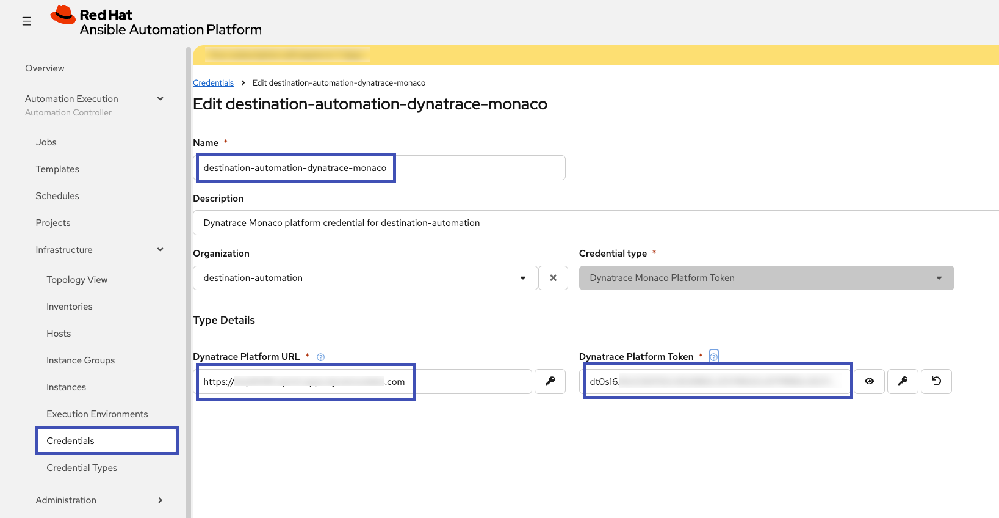
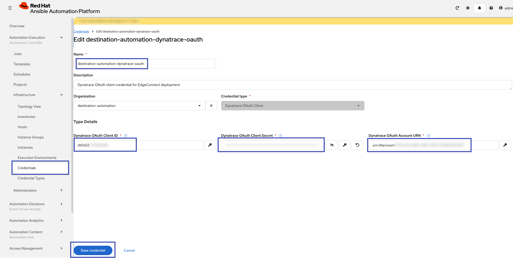
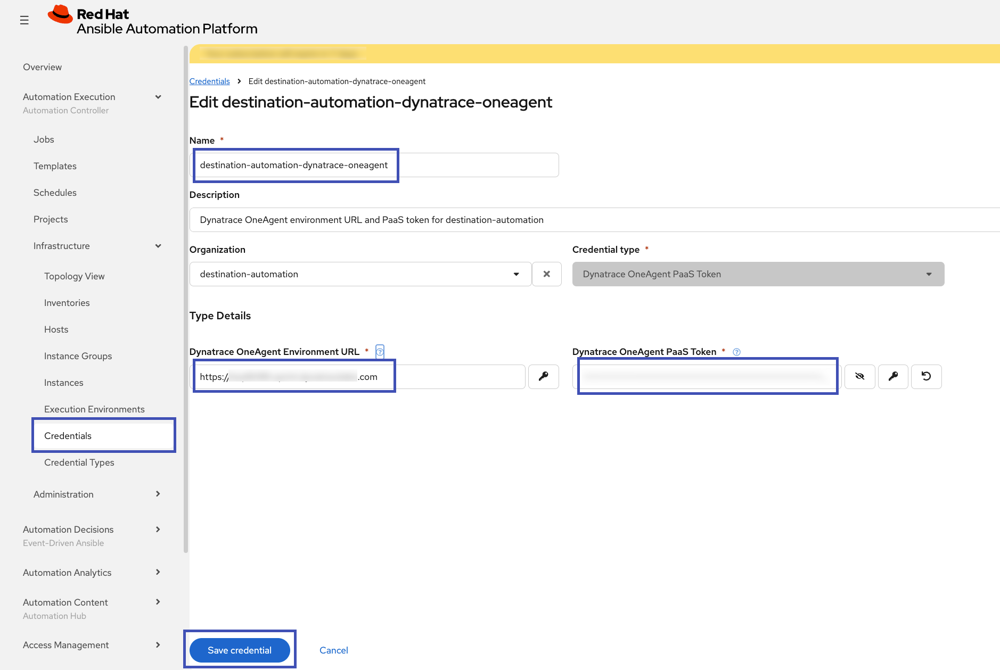
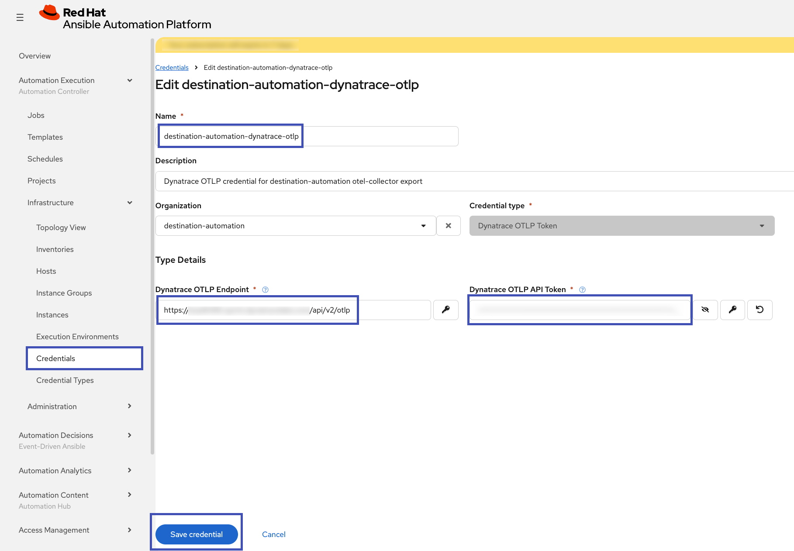
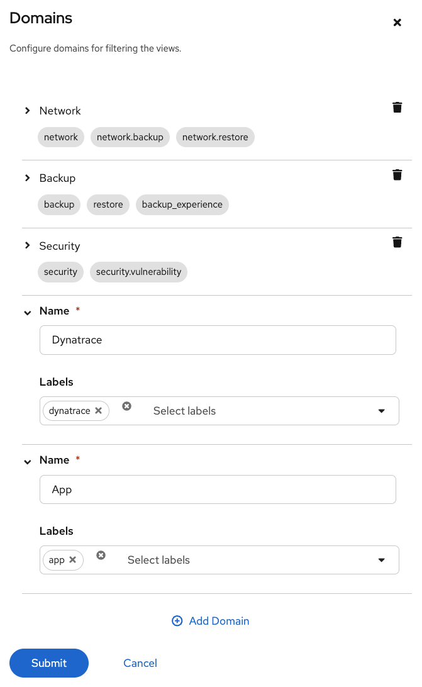
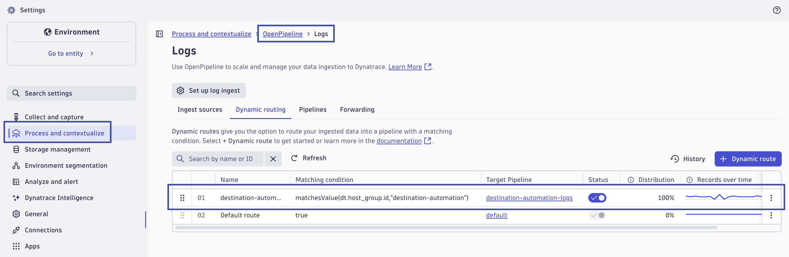
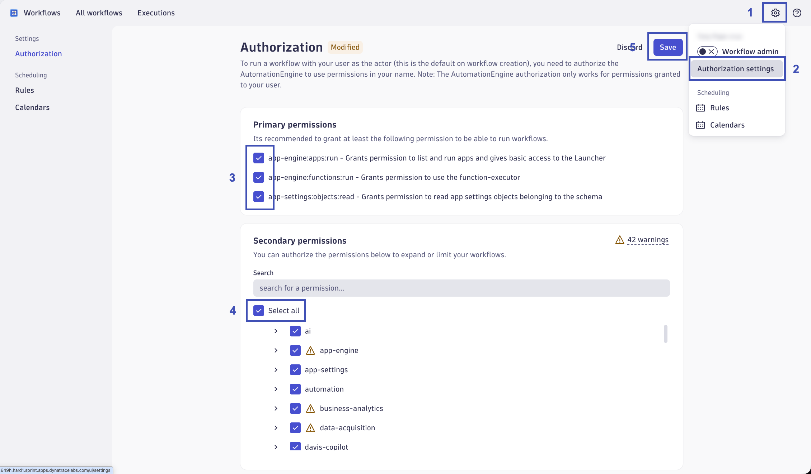
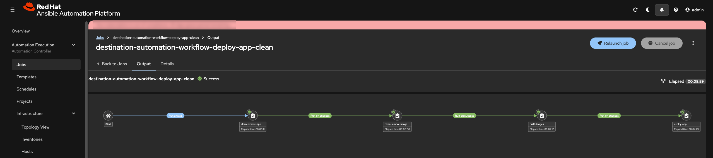
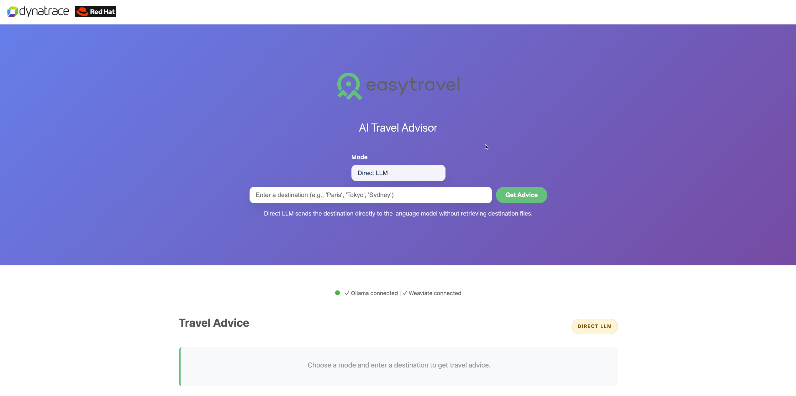

# Deploy

Deployment uses Red Hat AAP to configure platform objects and deliver both observability components and the AI application stack.

## Objectives

- Configure AAP Controller and EDA objects for the workshop.
- Deploy Dynatrace apps and API settings.
- Deploy EdgeConnect and OneAgent.
- Build and deploy the easyTravel AI Travel Advisor stack using Podman workflows.

## Step 1: Create AAP Service Account User

Before running deployment automation, create and validate the `aap-service-account` user on the RHEL host.

Reference guide:
[ansible/deploy/docs/aap-service-account-setup.md](https://github.com/dynatrace-wwse/workshop-destination-automation/blob/main/ansible/deploy/docs/aap-service-account-setup.md){target="_blank"}

## Step 2: Configure AAP and EDA

Run the bootstrap playbooks from the ansible directory.

```bash
cd ~/workshop-destination-automation/ansible
ansible-playbook deploy/playbooks/configure_aap.yml
```

```bash
ansible-playbook deploy/playbooks/configure_eda.yml
```

After playbook completion, review credentials and inventory objects in the AAP UI.

**Apply Credentials via UI**

- [ ] aap-service-account


- [ ] destination-automation-dynatrace-monaco



- [ ] destination-automation-dynatrace-oauth



- [ ] destination-automation-dynatrace-oneagent



- [ ] destination-automation-dynatrace-otlp



**Create Job Template Domains (optional, recommended)**

AAP Web UI -> Automation Execution (Automation Controller) -> Templates: Configure Domains (🔧 wrench icon)

- Name: Dynatrace
    - Labels: dynatrace
- Name: App
    - Labels: app



## Step 3: Deploy Dynatrace Components

Launch the relevant AAP job templates for:

- Dynatrace AppEngine apps
    - `destination-automation-deploy-dynatrace-apps`
- Dynatrace Monaco project
    - `destination-automation-deploy-dynatrace-monaco`
- Dynatrace EdgeConnect (when private network connectivity requires it)
    - `destination-automation-deploy-dynatrace-edgeconnect`
    - Verify you're using the correct value of `dynatrace_edgeconnect_oauth_endpoint` variable
- Dynatrace OneAgent on workshop host
    - `destination-automation-deploy-dynatrace-oneagent`

**Configure OpenPipeline Routing Tables (Manually):**

OpenPipeline routing tables are comprehensive for the environment.  If existing rules exist in the routing table, applying a new configuration with Monaco will delete/overwrite the existing rules.  To avoid this behavior, for now, routing table rules need to be created manually.

Logs:

- Name: 

```
destination-automation-logs
```

- Matching Condition: 

```
matchesValue(dt.host_group.id,"destination-automation")
```

- Pipeline: destination-automation-logs

Spans:

- Name: 

```
destination-automation-spans
```

- Matching Condition: 

```
matchesValue(dt.host_group.id,"destination-automation")
```

- Pipeline: destination-automation-spans

BizEvents:

- Name: 

```
destination-automation-bizevents
```

- Matching Condition: 

```
matchesValue(dt.host_group.id,"destination-automation")
```

- Pipeline: destination-automation-bizevents

Here is an example routing table for logs:


**Enable Workflows Authorization:**

Open the Workflows app.  In the top right corner, click on the gear icon, then Authorization Settings.  Enable all Primary Permissions.  Enable all Secondary Permissions.  Click Save.



## Step 4: Deploy the AI Travel Advisor Application

Run the workshop app deployment workflow template from AAP:

`destination-automation-workflow-deploy-app-clean`

This workflow template will perform the following:



- Remove the app if it already exists
- Remove the images if they already exist
- Build new app images
- Deploy the app as rootless podman containers
- Verify health endpoints and access

Access the app on port 81 (HTTP) of your public hostname (FQDN or IP).



## Validation

- [ ] Dynatrace components are installed and authenticated
- [ ] OneAgent reports data from the workshop host
- [ ] App stack is reachable and healthy
- [ ] AAP workflows complete without failed tasks

Continue to [Observe and Automate](observe-and-automate.md).
