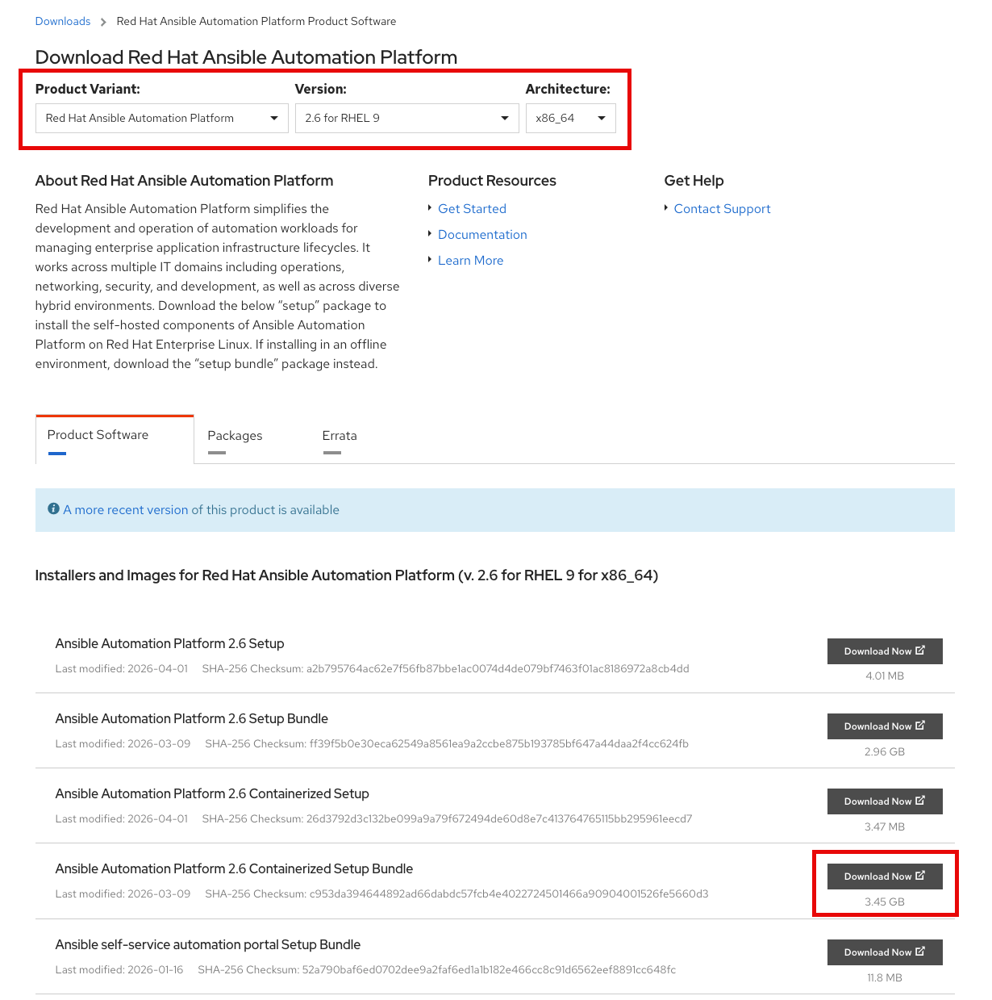

# Provision

Provisioning establishes your automation control plane on RHEL 9 and prepares execution images required by workshop jobs.

## Objectives

- Install Red Hat Ansible Automation Platform (containerized) on the workshop host.
- Prepare or import Execution Environment (EE) and Decision Environment (DE) images.
- Validate the platform is ready for deployment workflows.

## Step 1: Prepare the RHEL 9 Workshop Host

Install required packages and clone the workshop repository.

```bash
sudo dnf update -y
sudo dnf install -y ansible-core
sudo dnf install -y wget git-core rsync vim nano git
sudo dnf install -y podman
sudo dnf install -y python3-pip
```

Reboot is recommended, but not required.

```bash
sudo reboot
```

Clone the repository.

```bash
cd ~
git clone https://github.com/dynatrace-wwse/workshop-destination-automation.git
```

## Step 2: Download the AAP Install Tarball

Locate the `Ansible Automation Platform 2.6 Containerized Setup Bundle` for RHEL 9 at
[https://access.redhat.com/downloads](https://access.redhat.com/downloads), then download it to the host.



```bash
mkdir ~/redhat
cd ~/redhat
wget -O ansible-automation-platform-setup-bundle.tar.gz "<your-url-here>"
```

## Step 3: Install AAP Containerized

Move into the workshop ansible directory

```
cd ~/workshop-destination-automation/ansible
```

Create AAP target installation directory

```
export CURRENT_USER=$(whoami)
sudo mkdir /opt/ansible
sudo chown $CURRENT_USER:$CURRENT_USER /opt/ansible
```

Install ansible-galaxy collections

```
mkdir -p ~/.ansible/collections
ansible-galaxy collection install -r requirements.yml
```

Set your required variables and run the install playbook.  You may review additional installation variables in the documentation here: [AAP Containerized Quickstart](https://github.com/dynatrace-wwse/workshop-destination-automation/blob/main/ansible/provision/docs/aap_containerized_quickstart.md){target="_blank"}

```bash
export AAP_PUBLIC_HOSTNAME="<your-public-fqdn>"
export AAP_INSTALLER_LOCAL_PATH="$HOME/redhat/ansible-automation-platform-setup-bundle.tar.gz"
export AAP_ADMIN_PASSWORD="<your-strong-password>"
```
```bash
ansible-playbook provision/playbooks/install_aap_containerized.yml
```

!!! tip "Time Management Opportunity"
    Provisioning Red Hat Ansible Automation Platform will take some time.  It is recommended to create the [Dynatrace Tokens and Credentials](prerequisites.md#dynatrace-tokens-and-credentials) while AAP is installing.

After installation completes, you can validate AAP status with the included healthcheck script.

```bash
cd ~/workshop-destination-automation/ansible && ./aap_status.sh
```

## Step 4: Apply Subscription and Validate Access

- Open the AAP web console
    - https://{AAP-PUBLIC-HOSTNAME}:443/
    - You can expect a TLS certificate warning
- Apply your subscription/license
- Confirm Controller and Automation Hub are reachable

## Step 5: Build or Import Workshop Images

This workshop requires specific Ansible collections to be included in the Execution Environments and Decision Environments.  Use one of the following patterns to make the images available in your AAP/EDA instance.

### Option A: Build locally

If you choose to build locally, the default configurations **may** fail.  You will need to troubleshoot this on your own, requiring Ansible and ansible-builder expertise.

```bash
ansible-playbook provision/playbooks/build_custom_ee.yml
ansible-playbook provision/playbooks/build_custom_de.yml
```

### Option B: Import prebuilt images (recommended)

Images have been built, tested, and hosted in the GitHub registry for you.

```bash
ansible-playbook provision/playbooks/import_custom_ee.yml
ansible-playbook provision/playbooks/import_custom_de.yml
```

Default image sources are provided in the roles and can be overridden with environment variables.

## Validation

- [ ] AAP services are healthy on the host.
- [ ] Controller login is successful.
- [ ] Required EE and DE images exist in Automation Hub and can be referenced later.

Continue to [Deploy](deploy.md).
