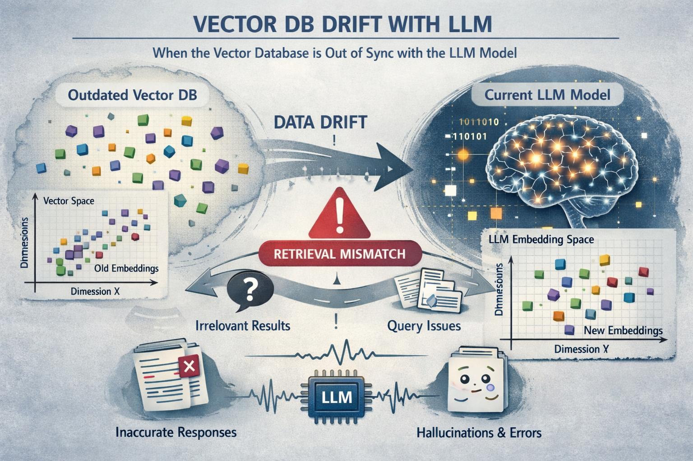
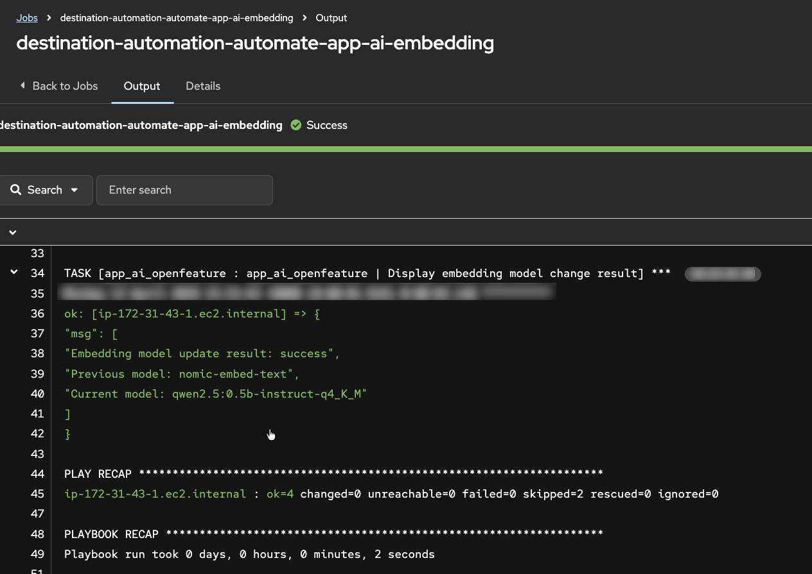
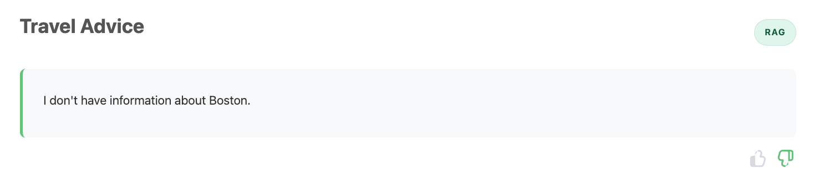
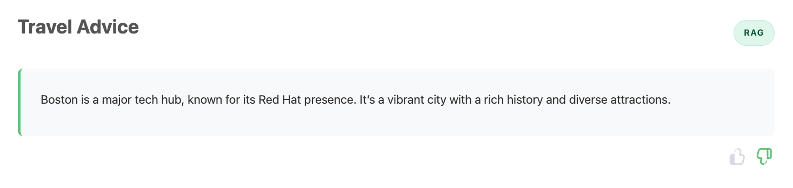
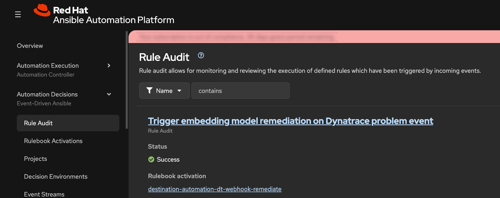
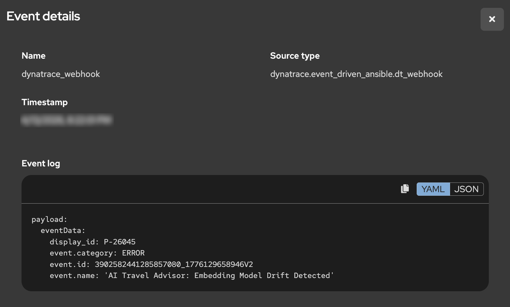
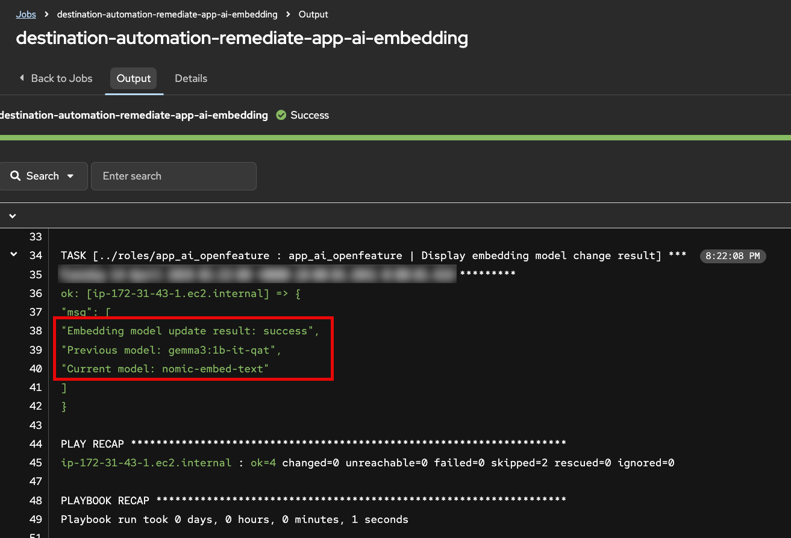
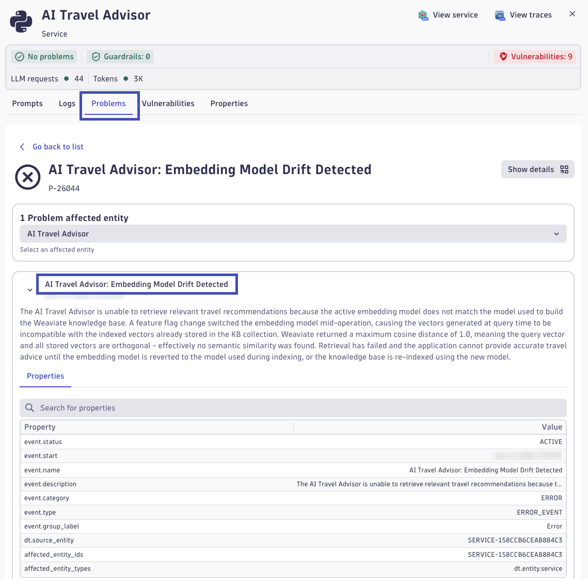
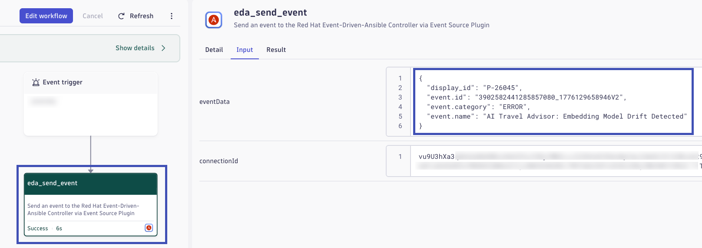

# Remediate

This phase demonstrates autonomous incident response: a model-related change introduces drift, Dynatrace detects impact, and Event-Driven Ansible restores a healthy state without manual intervention.

## Objectives

- Enable a feature flag that changes the AI embedding model.
- Observe impact without taking down the application.
- Validate Dynatrace detection of model drift and resulting problem state.
- Trigger EDA-driven remediation that restores known-good behavior.

## Step 1: Introduce Feature Flag Change

AI workloads introduce resiliency challenges beyond traditional uptime and error-rate monitoring. A service can stay online and still deliver poor outcomes because of AI-specific failure modes, including hallucinations, prompt-sensitivity, retrieval failures, and drift.

### What Is Drift and Why It Matters

In this lab, focus on **drift**: a gradual or sudden change that makes model outputs less reliable for the same business task.

Common causes include:

- Changes in user prompts, language patterns, or data distributions over time
- Changes in model versions or model parameters
- Changes in retrieval pipelines, ranking behavior, or document content
- Embedding model changes that are not synchronized with indexed vectors

Business impact of drift can be significant even when infrastructure is healthy:

- Lower answer relevance and trust, leading to poor user experience
- More escalation and rework for support and operations teams
- Increased token spend and latency from repeated or corrective prompts
- Compliance and brand risk when responses become inaccurate or inconsistent

**How a Vector Database and Embedding Model Work Together**

A vector database stores numeric vector representations of text (embeddings) so similar meaning can be retrieved quickly.

Typical flow:

1. Source documents are chunked into smaller passages
2. An embedding model converts each chunk into a high-dimensional vector
3. Those vectors are indexed in the vector database
4. At query time, the user prompt is embedded with the same embedding model
5. The database returns nearest-neighbor passages for RAG context

AI drift conceptual image: generated by AI, perhaps with a little drift and a few hallucinations.

**Why Embedding Changes Can Cause Poor LLM Performance**

Embedding spaces are model-specific. If stored document vectors were created with one embedding model, but live queries are embedded with a different model, similarity search quality can degrade sharply. The query and document vectors are no longer in the same semantic space, so retrieval returns weak or irrelevant context.

When retrieval quality drops, the LLM receives poorer grounding context, which can lead to:

- Generic or off-target answers
- Higher hallucination risk
- Inconsistent quality across repeated prompts

??? tip "OpenFeature"
    OpenFeature is an open standard and CNCF sandbox project that provides a vendor-neutral API and SDK model for feature flagging, so application code can evaluate flags consistently without being tightly coupled to a single flag provider. Feature flags are now a core operational control for modern systems, enabling safer releases, gradual rollouts, instant rollback, and controlled experimentation. The value OpenFeature provides is portability, reduced lock-in, and better engineering consistency: teams can standardize flag behavior across languages and services while still swapping providers, improving governance, and reducing risk when introducing or remediating production changes.

In this step, you will introduce a controlled embedding-model change, via an OpenFeature feature flag, to create observable drift conditions.

1. As the workshop instructor, in the AAP UI locate the `destination-automation-automate-app-ai-embedding` job template
2. Launch the job template and proceed to the **Extra Variables** prompt
3. For the new embedding model value, select the same model the application is currently using
4. Execute the job and confirm the application remains available

## Step 2: Observe Drift Behavior

Use this step to generate enough live traffic for Dynatrace Intelligence anomaly detection while observing response quality shifts in real time.

1. In the AI Travel Advisor app, run the same travel advice prompts you used earlier in the lab
2. For each response, submit feedback:
    - Thumbs up for relevant and useful responses
    - Thumbs down for generic, incorrect, or low-quality responses
3. Continue sending prompts for several minutes to create sustained telemetry
4. Try multiple destinations from the included destination list while using RAG
5. Switch between RAG and Direct LLM to compare behavior across both approaches

As you test, reflect on what has changed:

- Are RAG answers less grounded or less consistent than before?
- Do some destinations fail more often than others?
- Does Direct LLM work as expected, as it did before?
- Do repeated prompts produce unstable quality?

??? warning "Generic, incorrect, and low-quality responses"
    
    

### Return to Normal

Keep submitting prompts and feedback. After some time, you should observe that RAG responses begin returning to expected quality.

!!! question "Return to Normal"
    A few minutes ago the experience was clearly degraded: responses were weak, feedback trended negative, and users were getting frustrated. Now, without manual intervention, responses seem stable and useful again.

    Reflect on the following before moving to the next step:

    - What evidence tells you quality actually recovered (and this is not random luck)?
    - If no one manually fixed the app in the UI, what mechanisms or automations might have intervened?
    - Which signals would you expect to see in telemetry during the failure period vs the recovery period?
    - In a real production incident, how would you explain this "it was broken, now it's fine" moment to stakeholders?

## Step 3: Automated Recovery

When Dynatrace observability is connected to Red Hat EDA/AAP, detected problems can trigger trusted automated responses without waiting for manual intervention. This is auto-remediation: detect, decide, and act.

### How Event Driven Ansible Remediates

Event Driven Ansible (EDA) is a real-time event processing and automation engine that extends Ansible Automation Platform with the ability to listen for events from multiple sources and automatically trigger predefined workflows in response. Rather than waiting for scheduled jobs or manual operator intervention, EDA adds an orchestration layer that immediately evaluates incoming events against rulebook conditions and executes remediation actions when matches occur. This enables autonomous incident response where problems detected by observability platforms like Dynatrace can be automatically remediated without human delay. In this workshop, EDA receives AI degradation events from Dynatrace, matches them against rules, and automatically executes AAP job templates that restore the application to a healthy state.

**EDA Rule Audit**

1. In the AAP web interface, navigate to **Automation Decisions** -> **Rule Audit**
2. Find the recent event showing that EDA received an incoming event and matched it to a rule in the rulebook

What this means:

- Dynatrace detected a problem condition
- Dynatrace sends problem event data to Red Hat Event Driven Ansible
- EDA evaluated the event against rulebook logic
- EDA/AAP executes automation for matching rule

**EDA Event Action**

1. Open the event details from the Rule Audit record
2. Confirm the event source is Dynatrace and review the payload metadata describing the AI Travel Advisor problem
3. Review the triggered action tied to that event

You should see that a remediation job template was executed. The specific job is selected because the incoming event payload matched a rulebook condition that points to the desired remediation action.

??? abstract "EDA Rulebook"
    Rules are composed of conditions evaluated against the payload to determine the actions that EDA should take as a result.  The rule in this workshop is a very simple example of matching conditions in the JSON payload sent by Dynatrace.
    <pre><code class="language-yaml">
    rules:
    - name: "Trigger embedding model remediation on Dynatrace problem event"
      condition: |
        event.payload is defined and
        event.payload.eventData['event.category'] == 'ERROR' and
        event.payload.eventData['event.name'] == 'AI Travel Advisor: Embedding Model Drift Detected'
      action:
        run_job_template:
          name: "destination-automation-remediate-app-ai-embedding"
          organization: "destination-automation"
          extra_vars:
            app_ai_embedding_model_requested: "nomic-embed-text"</code></pre>

6. Open the related job execution output in AAP.
7. Verify the job changed the OpenFeature embedding-model flag back to the correct original model used to build the Weaviate collection.

This is the operational value of Red Hat EDA/AAP: secure, policy-driven automation that remediates issues across hybrid cloud environments using events from Dynatrace and many other sources.

## Step 4: Automated Anomaly Detection

In this step, explore how Dynatrace Intelligence automatically detects AI service problems from infrastructure to response quality.

### How Dynatrace Detects Anomalies

Dynatrace Intelligence continuously analyzes telemetry signals to automatically detect deviations from normal behavior. The detection approach combines multiple techniques:

??? info "Baseline Deviation"
    Dynatrace establishes dynamic baselines for key metrics by learning normal behavior patterns over time. When observed values deviate significantly from these baselines—whether up or down—an anomaly is flagged. For AI workloads, this includes application response time, error rate, and AI-specific metrics like vector database query performance and retrieval result quality.

??? info "Forecasting"
    Beyond static baselines, Dynatrace uses predictive forecasting to anticipate expected metric ranges. This accounts for time-of-day, day-of-week, and seasonal patterns in traffic and performance. Forecasting enables early detection of emerging issues before they become critical failures.

??? info "Alerting on Signal Ingest"
    Problems are detected at signal ingest time—as soon as anomalous telemetry arrives—not after batch processing or scheduled jobs. This immediate detection enables rapid remediation workflows and reduces the window of poor end-user experience.

**AI-Specific Metrics**

For AI observability, Dynatrace tracks specialized metrics including:

- **Vector retrieval distance**: How far the retrieved document vectors are from the query vector. Larger distances indicate weaker semantic similarity and lower-quality RAG grounding
- **Query result count**: How many relevant documents were found. Zero or very few results indicate retrieval failure
- **LLM request/response metrics**: Token counts, latency, model name, and span-level instrumentation of the generative AI pipeline
- **User feedback signals**: Thumbs-up/down and explicit ratings that correlate with LLM response quality

Together, these signals allow Dynatrace to detect not just infrastructure problems, but AI-specific quality degradation that impacts end users.

### From Automatic Detection to Event Orchestration

1. Open the Dynatrace environment and navigate to the **AI Observability** app
2. In the Explorer view, locate the **ai-travel-advisor** service
3. Click on the service to open the detail view
4. Navigate to the **Problems** tab to see automatically detected issues

You should see a problem card titled **AI Travel Advisor: Embedding Model Drift Detected**. This problem was automatically created when Dynatrace Intelligence detected the anomaly during your traffic generation in Step 2.  Click on the problem card to explore its details. You may see metrics related to **Weaviate vector distance** and retrieval scores.

**Understanding Vector Metrics: Distance and Quality**

Vector distance measures how far apart two embeddings are in the high-dimensional semantic space. Common distance metrics include:

- **Cosine distance**: Ranges from 0.0 (identical direction) to 1.0 (opposite direction). In embeddings, lower is better, values near 0.0 indicate strong semantic similarity
- **Euclidean distance**: Geometric distance in the vector space. Lower values indicate closer, more similar vectors

When your query vector is far from stored document vectors:

- The vector database returns matches with poorer semantic relevance
- The retrieved context is weaker or off-topic for the user's question
- The LLM receives less useful grounding, leading to generic or hallucinatory responses

**How Distance Signals Quality Issues**

In the normal case (using the correct embedding model):

- Query vectors and document vectors live in the same semantic space
- Vector distances are small and consistent
- Retrieved documents are highly relevant for RAG

In the degraded case (embedding model mismatch):

- Query and document vectors are in different semantic spaces
- Vector distances are large (the query is "far" from all stored documents)
- Retrieved documents may be irrelevant or missing entirely
- LLM receives poor context and produces poor answers

Dynatrace correlates high vector distances with low user satisfaction signals to create a clear problem statement: "Embedding Model Drift Detected."

**Explore the Problem-Triggered Workflow**

1. In the Dynatrace problem detail view, look for a **Workflow** section or **Notifications** section
2. Open the workflow execution that was triggered by this problem detection
3. Examine the workflow details to see:
   - The event payload sent by Dynatrace
   - How the problem data flows to Red Hat Event Driven Ansible
   - The orchestration actions executed as a result

The workflow represents the out-of-the-box integration between Dynatrace and Red Hat EDA/AAP. When a problem is detected, Dynatrace automatically sends event data—including the problem name, affected service, metrics, and context—directly to EDA. EDA's rulebook engine matches this event payload against rules and triggers appropriate remediation actions, all without manual operator involvement.

## The Value of Integrated Observability and Automation

This end-to-end flow demonstrates why modern observability and automation platforms must work together:

**Comprehensive AI Monitoring**

Dynatrace provides visibility into the complete AI pipeline:

- Infrastructure and transactional health (request latency, error rates, resource utilization)
- Application performance (code-level instrumentation and spans)
- AI workload quality (embeddings, retrieval metrics, model performance, user satisfaction)

**Automatic Problem Detection**

Dynatrace Intelligence automatically detects anomalies without requiring manual threshold tuning. This is critical for AI workloads where "normal" is harder to define and often changes based on data distributions and user behavior.

**Immediate Remediation**

By connecting Dynatrace to Red Hat EDA/AAP, detected problems trigger automated remediation workflows instantly. Infrastructure or AI issues can be resolved in seconds, not hours. This reduces Mean Time To Recovery (MTTR) and minimizes user impact.

**Enterprise Notifications**

Dynatrace's out-of-the-box integrations with ServiceNow, JIRA, Slack, PagerDuty, and many others, ensure that teams across operations, development, and business stakeholders are informed of AI service quality issues and remediation actions, enabling coordinated incident response.

!!! question "Reflection: Your Organization's AI Readiness"
    Pause here and reflect on your own environment. If your organization is currently introducing AI capabilities, how confident are you that you can detect quality degradations quickly when no infrastructure outage occurs? Many teams can monitor uptime and errors, but struggle to detect semantic failures such as retrieval drift, hallucination trends, or declining user trust before business impact becomes visible.

    Consider the operational challenge from end to end: signal collection, anomaly detection, triage, ownership, and remediation execution. How long would it take your teams today to recognize an AI quality issue, identify the likely root cause, and apply a safe correction across platforms? What customer, revenue, compliance, or brand risk accumulates during that detection-to-resolution window?

    Use this lab outcome as a benchmark for future-state capabilities. The goal is not only to build AI features, but to build AI resilience: observable quality signals, intelligent detection, event-driven remediation, and clear enterprise communication that together reduce mean time to detect and mean time to recover.

## Validation

- [ ] Embedding model feature flag was changed via AAP job template without causing an application outage
- [ ] RAG response quality degraded while Direct LLM remained unaffected, confirming drift is retrieval-specific
- [ ] Dynatrace Intelligence automatically detected and created the **AI Travel Advisor: Embedding Model Drift Detected** problem
- [ ] Dynatrace workflow executed and sent problem event data to Red Hat Event Driven Ansible
- [ ] EDA Rule Audit confirmed the event was received, matched rulebook conditions, and triggered the remediation job template
- [ ] Service recovered automatically—RAG response quality returned to expected baseline without manual intervention

Continue to [Summarize](summarize.md).
